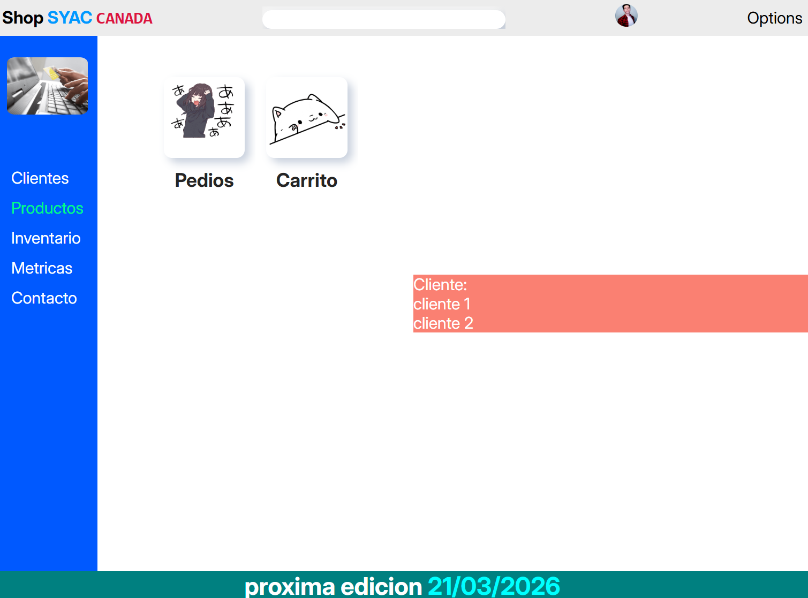
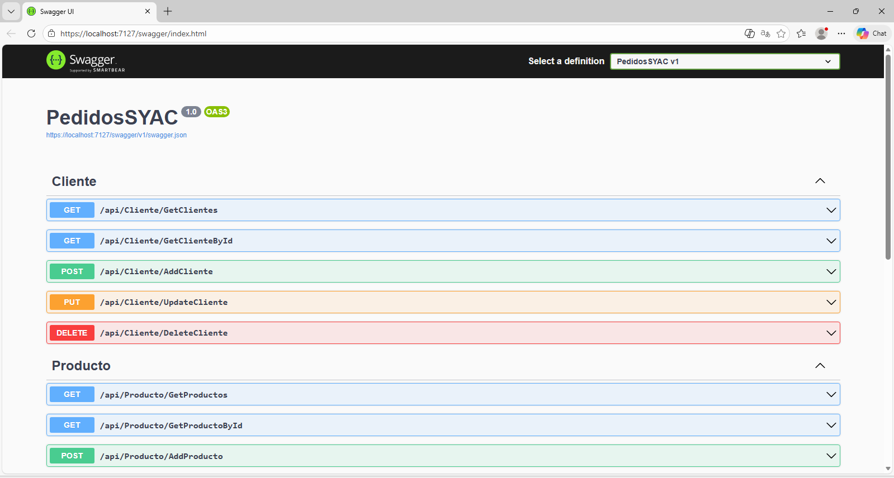
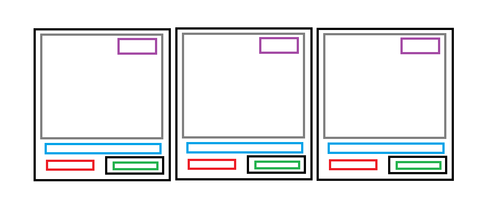
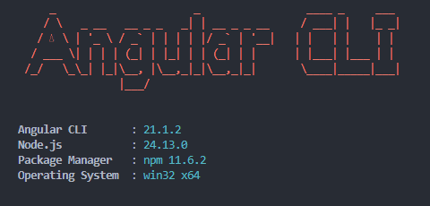
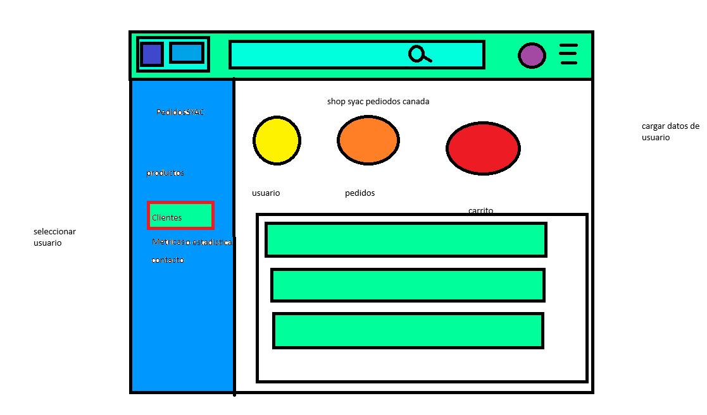

# Aplicacion web de pedidos

> codigo **BackeEnd** **C#** **.NET** **apiREST** para ver y solicitar pedidos de productos por cliente
## Se utiliza codigo de proyecto base apiREST, se aplican tecnologias como:

- [x] C# .NET 7
- [x] SQL Server
- [x] MVC
- [x] POO
- [x] SOLID
- [x] XUNIT
- [x] AutoMapper
- [x] Swagger
- [x] Entity Framework
- [x] Angular V 21
---
> :information_source: en curso...

> codigo **frontend** Angular en ***En proceso...***

> codigo **SQL** `tablas (Cliente, Producto, Pedido)`
> la creacion de las tablas es mediante EF Migrador y SQL backup  :warning: (EF emitio que no puede confiar el el certificado ssl durante la prueba)
    Tablas:

*Cliente*
- [x] Id, Identificacion, Nombre, Direccion
*Producto*
- [x] Id , Nombre, Cantidad, ValorUnitario
*Estado*
- [x] Id , Estado
*Pedido*
- [x] Id, Id_Cliente, Id_Producto, Id_Estado, ValorTotal

> ### Cambios que se estan o se han realizando posteriores a la prueba:
- [x] Funcionamiento EF 100%
- [x] Funcionalidad que agrega los **Estados** sin intervencion del usuario
- [x] Mejora de entidades y relaciones `Tablas adicionales` *Estados*, *ProductosXPedido*
- [ ] Prioridad (Regla prioridad del pedido con base en el monto total; Baja: <= $500, Media: > $500 y <=1000, Alta: >1000)
- [ ] Se puede implementar un singleton para los **Estados**
- [x] Creacion componentes Angular
- [ ] UX/IU Responsive

>### posibles tablas y funciones
- [ ] facturas
- [ ] historico
- [ ] auditoria
- [ ] logs

[***Portafolio***](https://haku777.vercel.app)

